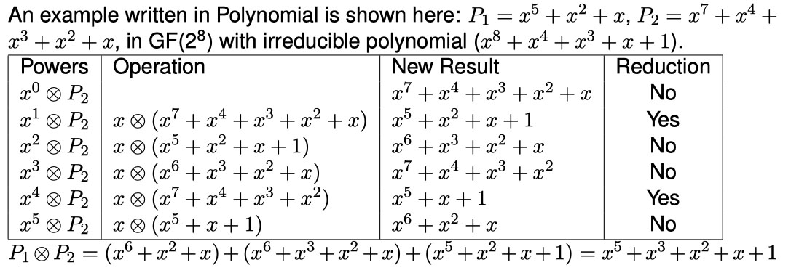
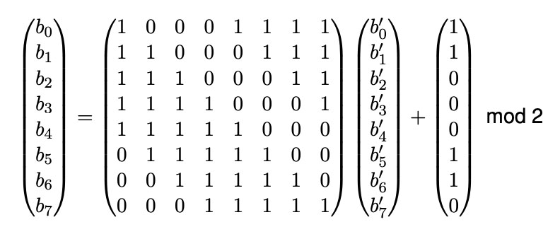
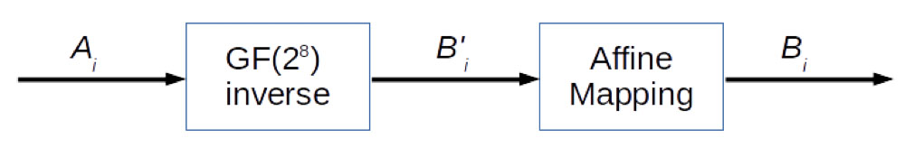

# Lab 5: Modular Arithmetics

**Deadline: 13 Oct (2359)**

- [Lab 5: Modular Arithmetics](#lab-5-modular-arithmetics)
  - [Objectives](#objectives)
  - [Part I: Algebraic Structures](#part-i-algebraic-structures)
    - [Polynomial2 Methods](#polynomial2-methods)
  - [Part II: Galois Field](#part-ii-galois-field)
  - [Part III: Generate Tables](#part-iii-generate-tables)
  - [Part IV](#part-iv)
    - [1. Quiz](#1-quiz)
    - [2. AES Byte Substitution Layer](#2-aes-byte-substitution-layer)
  - [Submission](#submission)
    - [eDimension Submission](#edimension-submission)

## Objectives

- Implement a class to do Number Theory computation in GF(2<sup>n</sup>)
- (Optional) Implement Byte Substitution layer of AES encryption

You are provided with a file `gf2ntemplate.py` to assist you. Your code will need to pass the test cases at the end of the file.

## Part I: Algebraic Structures

In this section, you will create a class `Polynomial2` where:

- An instance of the class represents a polynomial, which can be of any arbitrary [degree](https://en.wikipedia.org/wiki/Degree_of_a_polynomial)
- Each coefficient is in [GF(2)](<https://en.wikipedia.org/wiki/GF(2)>) - i.e. it can either be 0 or 1
- The constructor takes in a list containing the values of the coefficient of the polynomial starting from the lowest power to the highest power

For example, to create x<sup>5</sup> + x<sup>2</sup> + x:

```python
x = Polynomial2([0,1,1,0,0,1])
```

(A note on notation: X^N in this document is the same as X<sup>N</sup>)

### Polynomial2 Methods

You will need to implement some methods. Test Cases are provided at the end of the included template script.

**`add()` and `sub()`**

- Write the method `add()` and `sub()` to perform addition and subtraction.
- To do addition, you XOR the coefficient of the same powers.
- Addition and subtraction operations on polynomials are the same operation.
- To understand why, take a look at the [truth tables for GF(2)](<https://en.wikipedia.org/wiki/GF(2)#Definition>)
- The method should return a new `Polynomial2` object.

```python
p3 = p1.add(p2)
p3 = p1.sub(p2)
```

**Modulus Multiplication with `mul()`**

- Overwrite the method `mul()` to perform modulus multiplication.
- The method takes in another polynomial `p2` to be multiplied and the modulus polynomial `modp` and returns a new `Polynomial2` object.
- The default value for the modulus polynomial is `None`. If `modp`
  is given, the multiplication is done with modulus with respect to `modp`.

```python
p3 = p1.mul(p2, modp)
```

To do modulus multiplication, we first generate the partial results. For example, instead of finding the result of (x<sup>2</sup> ⊕ P2), the program finds the result of (x ⊕ (x ⊕ P2)).

Generate partial results as follows:

- If the most significant bit of the previous result is 0, just shift the previous result one bit to the left. This is basically multiplying the polynomial with an x.
- If the most significant bit of the previous result is 1, we need to do the following:
  - 1. shift it one bit to the left, and
  - 2. XOR it with the modulus without the most significant bit.
  - This basically means that if we multiplying the polynomial with an x and the result has the same degree as the modulus, we need to reduce the result with the irreducible polynomial or the modulus.

According to the coefficients in the polynomial, add up the partial results to get the final result.

If the multiplication is done without any modulus, simply generate partial results by shifting the previous partial result one bit to the left, then add up the partial results to get the final result.



**Euclidian Division with `div()`**

- Write the method `div()` to perform division.
- Use the Euclidian Division algorithm: [https://en.wikipedia.org/wiki/Polynomial_greatest_common_divisor#Euclidean_division](https://en.wikipedia.org/wiki/Polynomial_greatest_common_divisor#Euclidean_division).
- The method should return two polynomials, one for the quotient and the other for the remainder.

```python
p_qnt, p_rmd = p1.div(p2)
```

In the Euclidian Division algorithm, `deg()` stands for the degree of its argument, and `lc()` stands for the leading coefficient, or the coefficient of the highest degree of the variable.

```python
# Euclidean division
# Input: a and nonzero b (two polynomials in the variable x);
# Output: q, the quotient and r, the remainder;
# begin
q:=0; r:=a;
d:=deg(b); c:=lc(b);
while deg(r) >= d do
  s:=(lc(r)/c)x^{deg(r)-d};
  q:=q+s;
  r:=r-sb;
end do;
return (q, r);
# end
```

**Other Methods**

- Overwrite the `__str__()` method so that it can print the polynomial. For example: `x^5+x^3+x^1+x^0`.
- Write a method `getInt()` that returns the equivalent integer value of the polynomial represented.

## Part II: Galois Field

- Create a class with the name `GF2N` that implements Galois Field.
- An instance of this class belongs to a finite field with the number of element equals to 2<sup>n</sup>.
- The constructor takes in `x`, `n`, and `ip`:
  - `x` is the number to be represented in Galois Field
  - `n` is the power, as in 2<sup>n</sup>
  - `ip` is the irreducible polynomial.
  - The default for `n` is 8.
  - The constructor stores the number as a `Polynomial2` of degree `n-1`.
  - The default irreducible polynomial is: `P(x) = x^8 + x^4 + x^3 + x + 1`. (This is the irreducible polynomial in AES)

You will need to implement some methods. Test Cases are provided at the end of the included template script.

- Implement methods to do addition, subtraction, multiplication, and division.
- Implement a method `getPolynomial2()` that returns the polynomial representation of the number.
- Implement a method `getInt()` that returns the integer value
- Overwrite `__str__()` method so that it can print the integer value.

## Part III: Generate Tables

Create a table for addition and multiplication for GF(2<sup>4</sup>), using (x<sup>4</sup> + x<sup>3</sup> + 1) as the modulus.

Save the table as a text file (`table1.txt`), you will need to submit it.

Your own self-objective (no submission): You should be able to show the workings of addition and multiplication of GF(2n
) by hand.

## Part IV

In this section, you will choose **one** of the following to attempt:

1. A short True/False quiz (individual work)
2. Implement AES Byte Substitution Layer

#### 1. Quiz

Answer True/False to each of the following questions:

1. There is no difference between addition and subtraction operation for all elements of GF(3).
2. There is no difference between addition and subtraction operation for all elements of GF(2<sup>N</sup>), for any integer N.
3. For all elements of GF(2), multiplication is equivalent to an AND gate.
4. There are only 256 possible values in the extension field GF(2^8).
5. P(x) = x^4 + x^3 + x + 1 is a irreducible polynomial.

Save your answers as `quiz.txt`.

#### 2. AES Byte Substitution Layer

- Inversion in GF(2^8) is the core operation of the Byte Substitution transformation which contains the AES S-Boxes. In this exercise, you need to implement multiplicative inverse as a method in `GF2N` class using the Extended Euclidean Algorithm.
- [https://en.wikipedia.org/wiki/Extended_Euclidean_algorithm](https://en.wikipedia.org/wiki/Extended_Euclidean_algorithm)

**Extended Euclidean Algorithm**

The algorithm can be written as follows. Assume that the Polynomial we want to find the inverse is `b` and the modulus polynomial is `n`.

```python
r1 <- n; r2 <- b;
t1 <- 0; t2 <- 1;
while (r2 > 0)
{
  q <- r1/r2;
  r <- r1 - q x r2;
  r1 <- r2; r2 <- r;
  t <- t1 - q x t2;
  t1 <- t2; t2 <- t;
}
if (r1 = 1) then return t1;
```

**Affine mapping method**

- Implement affine mapping `affineMap()` method in GF2N class.
- Affine mapping is described as the following transformation:



**Byte Substitution layer of AES S-box**

Implement Byte Substitution layer of AES S-box as follows:

- S(A<sub>i</sub>) = B<sub>i</sub>
- B<sub>i</sub> is the output of `affineMap(Bi_prime)`
- `Bi_prime` is the output of `Ai.mulInv()`
- `Ai` is in GF(2<sup>8</sup>)



**Generate Table**

Generate Table 4.3 on page 101 of Understanding Cryptography.

Save the table as a text file (`table2.txt`), you will need to submit it.

Your own self-objective (no submission): You should be able to show the working of finding the inverse multiplication by hand.

## Submission

### eDimension Submission

Submission ground rules:

- Please make sure to indicate your name and student ID in each of the graded submission files
- You are allowed to collaborate with **one** other student. If you choose to do so, both of your name/student ID should be indicated in the submission files. Both are still required to submit the files individually.
- Except for within each pair of students that are collaborating, you are not allowed to share answers and solutions.

Lab 4 submission:

Upload a **zip file** with the following:

- `gf2n.py`
- `table1.txt`
- `quiz.txt` (if attempted)
- `table2.txt` (if attempted)

**Deadline: 20 Oct (2359)**
